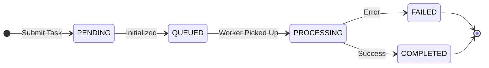

# API Reference Guide - Content search

This document defines the communication protocol between the Frontend and Backend for asynchronous file processing tasks.

---

## Global Response Specification

All HTTP Response bodies must follow this unified JSON structure:

| Field | Type | Required | Description |
| :--- | :--- | :--- | :--- |
| **code** | Integer | Yes | Application Logic Code. 20000 indicates success; others are logical exceptions. |
| **data** | Object/Array | Yes | Application data payload. Returns {} or [] if no data is available. |
| **message** | String | Yes | Human-readable message for frontend display (e.g., "Operation Successful"). |
| **timestamp** | Long | Yes | Server-side current Unix timestamp. |

### Response Example
```
HTTP/1.1 200 OK
Content-Type: application/json

{
  "code": 20000,
  "data": { "task_id": "0892f506-4087-4d7e-b890-21303145b4ee", "status": "PROCESSING" },
  "message": "Operation Successful",
  "timestamp": 167890123
}
```
---

## Status Codes and Task

### HTTP Status Codes (Network Layer)
| Code | Meaning | Frontend Handling Suggestion |
| :--- | :--- | :--- |
| 200 | OK | Proceed to parse Application Layer code. |
| 201 | Created | Resource successfully created and persisted in the database. |
| 202 | Accepted | Task accepted for the backend. |
| 401 | Unauthorized | Token expired; clear local storage and redirect to Login. |
| 403 | Forbidden | Insufficient permissions for this resource. |
| 422 | Unprocessable Entity | Parameter validation failed (e.g., wrong file format). |
| 500 | Server Error | System crash; display "Server is busy, please try again". |

### Application Layer Codes (code field)
| Application Code | Semantic Meaning | Description |
| :--- | :--- | :--- |
| 20000 | SUCCESS | Task submitted or query successful. |
| 40001 | AUTH_FAILED | Invalid username or password. |
| 50001 | FILE_TYPE_ERROR | Unsupported file format (Allowed: mp4, mov, jpg, png, pdf). |
| 50002 | TASK_NOT_FOUND | Task ID does not exist or has expired. |
| 50003 | PROCESS_FAILED | Internal processing error (e.g., transcoding failed). |

---
### Task Lifecycle & Status Enum
The `status` field in the response follow this lifecycle:

| Status | Meaning | Frontend Action |
| :--- | :--- | :--- |
| PENDING | Task record created in DB. | Continue Polling. |
| QUEUED | Task is in the background queue, waiting for a worker. | Continue Polling. |
| PROCESSING | Task is currently being handled (e.g., transcoding). | Continue Polling (Show progress if available). |
| COMPLETED | Task finished successfully. | Stop Polling & Show Result. |
| FAILED | Task encountered an error. | Stop Polling & Show Error Message. |

### State Transition Diagram


## API Endpoints
### Task endpoints
#### Get Task List

* URL: /api/v1/task/list

* Method: GET

* Pattern: SYNC

Query Parameters:
| Parameter | Type    | Required | Default | Description                                         |
| :-------- | :------ | :------- | :------ | :-------------------------------------------------- |
| `status`  | string  | No       | None    | Filter by: `QUEUED`, `PROCESSING`, `COMPLETED`, `FAILED` |
| `limit`   | integer | No       | 100     | Max number of tasks to return (Min: 1, Max: 1000)   |

Request:
```
curl --location 'http://127.0.0.1:9011/api/v1/task/list?status=COMPLETED&limit=2'
```
Response (200 OK)
```json
{
    "code": 20000,
    "data": [
        {
            "status": "COMPLETED",
            "payload": {
                "source": "minio",
                "file_key": "runs/f52c2905-fb78-4ddd-a89e-9fb673546740/raw/application/default/apple_loop100.h265",
                "bucket": "content-search",
                "filename": "apple_loop100.h265",
                "run_id": "f52c2905-fb78-4ddd-a89e-9fb673546740"
            },
            "result": {
                "message": "File from MinIO successfully processed. db returns {}"
            },
            "progress": 0,
            "task_type": "file_search",
            "id": "56cc417c-9524-41a9-a500-9f0c44a05eac",
            "user_id": "admin",
            "created_at": "2026-03-24T12:50:34.281421"
        },
        {
            "status": "COMPLETED",
            "payload": {
                "source": "minio",
                "file_key": "runs/2949cc0e-a1aa-4001-aa0f-8f42a36c3e7c/raw/application/default/apple_loop100.h265",
                "bucket": "content-search",
                "filename": "apple_loop100.h265",
                "run_id": "2949cc0e-a1aa-4001-aa0f-8f42a36c3e7c"
            },
            "result": {
                "message": "File from MinIO successfully processed. db returns {}"
            },
            "progress": 0,
            "task_type": "file_search",
            "id": "8032db45-129b-4474-8d58-122f33661f19",
            "user_id": "admin",
            "created_at": "2026-03-24T12:48:13.301178"
        }
    ],
    "message": "Success",
    "timestamp": 1774330753
}
```
#### Task Status Polling
Used to track the progress and retrieve the final result of a submitted task.

* URL: /api/v1/task/query/{task_id}

* Method: GET

* Pattern: SYNC

Request:
```
curl --location 'http://127.0.0.1:9011/api/v1/task/query/6b9a6a55-d327-42fe-b05e-e0f3098fe797'
```

Response (200 OK):
```json
{
    "code": 20000,
    "data": {
        "task_id": "6b9a6a55-d327-42fe-b05e-e0f3098fe797",
        "status": "COMPLETED",
        "progress": 100,
        "result": {
            "message": "Upload only, no ingest requested",
            "file_info": {
                "source": "minio",
                "file_key": "runs/9e96f16a-9689-4c25-a515-04a1040b193f/raw/text/default/phy_class.txt",
                "bucket": "content-search",
                "filename": "phy_class.txt",
                "run_id": "9e96f16a-9689-4c25-a515-04a1040b193f"
            }
        }
    },
    "message": "Query successful",
    "timestamp": 1774931711
}
```
### File Process
#### File Support Matrix

The system supports the following file formats for all ingestion and upload-ingest operations.

| Category | Supported Extensions | Processing Logic |
| :--- | :--- | :--- |
| **Video** | `.mp4` | Frame extraction, AI-driven summarization, and semantic indexing. |
| **Document** | `.txt`, `.pdf`, `.docx`, `.doc`, `.pptx`, `.ppt`, `.xlsx`, `.xls` | Full-text extraction, semantic chunking, and vector embedding. |
| **Web/Markup** | `.html`, `.htm`, `.xml`, `.md`, `.rst` | Structured text parsing and content indexing. |
| **Image** | `.jpg`, `.png`, `.jpeg` | Visual feature embedding and similarity search indexing. |

> **Technical Note**: 
> - **Video**: Default chunking is set to 30 seconds unless the `chunk_duration` parameter is provided.
> - **Text**: Automatic semantic segmentation is applied to ensure high-quality retrieval results.
> - **Max File Size**: Please refer to the `CS_MAX_CONTENT_LENGTH` environment variable (Default: 100MB).

#### File Upload
Used to upload a video file and initiate an asynchronous background task.

* URL: /api/v1/object/upload
* Method: POST
* Content-Type: multipart/form-data
* Payload: file (Binary)
* Pattern: ASYNC

Request:
```
curl --location 'http://127.0.0.1:9011/api/v1/object/upload' \
--form 'file=@"/C:/videos/videos/car-detection-2min.mp4"'
```
Response (200 OK):
```json
{
    "code": 20000,
    "data": {
        "task_id": "c68211de-2187-4f52-b47d-f3a51a52b9ca",
        "status": "PROCESSING"
    },
    "message": "File received, processing started.",
    "timestamp": 1773909147
}
```

#### File ingestion
* URL: /api/v1/object/ingest
* Method: POST
* Pattern: ASYNC
* Parameters:

| Field | Type | Required | Description |
| :--- | :--- | :--- | :--- |
| file_key | string | Yes | The full path of the file in MinIO (excluding bucket name). |
| bucket_name | string | No | The MinIO bucket name. Defaults to content-search. |
| prompt | string | No | Instructions for the AI (VLM). Defaults to "Please summarize this video." |
| chunk_duration | integer | No | Duration of each video segment in seconds. Defaults to 30. |
| meta | object | No | Custom metadata (e.g., {"tags": ["lecture"]}). Used for filtering during search. |

Request:
```
curl --location 'http://127.0.0.1:9011/api/v1/object/ingest' \
--header 'Content-Type: application/json' \
--data '{
    "bucket_name": "content-search", 
    "file_key": "runs/c9a34e33-284a-48af-8d41-2b0d7d2989a7/raw/video/default/classroom_8.mp4"
}'
```
Response:
```json
{
    "code": 20000,
    "data": {
        "task_id": "44e339fb-3306-41b8-b1e1-4ecae7ce0ada",
        "status": "PROCESSING",
        "file_key": "runs/c9a34e33-284a-48af-8d41-2b0d7d2989a7/raw/video/default/classroom_8.mp4"
    },
    "message": "Ingestion process started for existing file",
    "timestamp": 1774878031
}
```
#### Text file ingestion
Primarily processes raw text strings passed in the request body for semantic indexing. It also supports fetching content from existing text-based objects in MinIO.

* URL: /api/v1/object/ingest-text
* Method: POST
* Pattern: ASYNC
* Parameters:

| Field | Type | Required | Default | Description |
| :--- | :--- | :--- | :--- | :--- |
| `text` | `string` | **Yes** | — | **Raw text content** to be segmented, embedded, and stored in the vector database. |
| `bucket_name` | `string` | No | — | MinIO bucket name (used to logically group the data or build the identifier). |
| `file_path` | `string` | No | — | Logical path or filename (used as a unique identifier for the text source). |
| `meta` | `object` | No | `{}` | Extra metadata to store alongside the text (e.g., `course`, `author`, `tags`). |

Request:
```
# example for raw text content
curl --location 'http://127.0.0.1:9011/api/v1/object/ingest-text' \
--header 'Content-Type: application/json' \
--data '{
    "text": "Newton'\''s Second Law of Motion states that the force acting on an object is equal to the mass of that object multiplied by its acceleration (F = ma). This relationship describes how the velocity of an object changes when it is subjected to an external force.",
    "meta": {
        "source": "topic-search"
    }
}'
```
Response:
```json
{
    "code": 20000,
    "data": {
        "task_id": "df3caeb3-3287-4e41-a1f0-098c90d08e03",
        "status": "PROCESSING"
    },
    "message": "Text ingestion task created successfully",
    "timestamp": 1775006765
}
```

#### File upload and ingestion
A unified workflow that first saves the file to MinIO and then immediately initiates the ingestion pipeline. Features full content indexing and AI-driven Video Summarization for supported video formats.

* URL: /api/v1/object/upload-ingest
* Method: POST
* Content-Type: multipart/form-data
* Pattern: ASYNC
* Parameters:

| Field | Type | Required | Description |
| :--- | :--- | :--- | :--- |
| file | Binary | Yes | The video file to be uploaded. |
| prompt | string | No | Summarization instructions (passed as a Form field). |
| chunk_duration | integer | No | Segment duration in seconds (passed as a Form field). |
| meta | string | No | JSON string of metadata (e.g., '{"course": "CS101"}'). |

* Example:
Request:
```
curl --location 'http://127.0.0.1:9011/api/v1/object/upload-ingest' \
--form 'file=@"/C:/videos/videos/classroom_8.mp4"' \
--form 'meta="{\"tags\": [\"class\"], \"course\": \"CS101\", \"semester\": \"Spring 2026\"}"'
```
Response (200 OK):
```json
{
    "code": 20000,
    "data": {
        "task_id": "559814ae-cef6-475c-9a79-3819549228d9",
        "status": "PROCESSING",
        "file_key": "runs/a955dbfc-59eb-4e40-953f-0cfe55e54464/raw/video/default/classroom_8.mp4"
    },
    "message": "Upload and Ingest started",
    "timestamp": 1774878113
}
```

#### Retrieve and Search
Executes a similarity search across vector collections using either natural language queries or base64-encoded images. Returns ranked results with associated metadata and MinIO object references.

* URL: /api/v1/object/search
* Method: POST
* Content-Type: multipart/form-data
* Pattern: SYNC
* Parameters:

| Field | Type | Required | Description |
| :--- | :--- | :--- | :--- |
| query | string | Either | Natural language search query (e.g., "student at desk"). |
| image_base64 | string | Either | Base64 encoded image string for visual similarity search. |
| max_num_results | integer | No | Maximum number of results to return. Defaults to 10. |
| filter | object | No | Metadata filters (e.g., {"run_id": "...", "tags": ["class"]}). |

* Example:
Request:
```
curl --location 'http://127.0.0.1:9011/api/v1/object/search' \
--header 'Content-Type: application/json' \
--data '{
    "query": "student in classroom",
    "max_num_results": 1,
    "filter": {
        "tags": ["classroom", "student"]
    }
}'
```
Response (200 OK):
```json
{
    "code": 20000,
    "data": {
        "results": [
            {
                "id": "1680138485034402529",
                "distance": 0.47685748,
                "meta": {
                    "start_frame": 0,
                    "chunk_text": "The video depicts a classroom setting with four individuals seated at desks arranged in a U-shape. The room has a modern design with blue chairs, white tables, and a whiteboard on the right side. The walls are adorned with various posters and a large mirror reflecting part of the room. The lighting is bright, creating a well-lit environment. The individuals appear to be engaged in a discussion or presentation, with one person standing and gesturing towards the others. The overall atmosphere suggests an educational or collaborative activity taking place.",
                    "reused": false,
                    "start_time": 0.0,
                    "asset_id": "classroom_8.mp4",
                    "file_path": "minio://content-search/runs/81802f9e-0a28-4486-bad2-2e05c1086326/derived/video/classroom_8.mp4/chunksum-v1/summaries/chunk_0001/summary.txt",
                    "run_id": "81802f9e-0a28-4486-bad2-2e05c1086326",
                    "type": "document",
                    "end_time": 0.32,
                    "summary_minio_key": "runs/81802f9e-0a28-4486-bad2-2e05c1086326/derived/video/classroom_8.mp4/chunksum-v1/summaries/chunk_0001/summary.txt",
                    "doc_filetype": "text/plain",
                    "chunk_id": "chunk_0001",
                    "minio_video_key": "runs/c9a34e33-284a-48af-8d41-2b0d7d2989a7/raw/video/default/classroom_8.mp4",
                    "chunk_index": 0,
                    "tags": [
                        "class",
                        "student"
                    ],
                    "end_frame": 8
                }
            }
        ]
    },
    "message": "Search completed",
    "timestamp": 1774877744
}
```
#### Resource Download (Video/Image/Document)
Download existing resources in Minio.

* URL: /api/v1/object/download/{resource_id}
* Method: GET
* Pattern: SYNC
Request:
```
curl --location 'http://127.0.0.1:9011/api/v1/object/download?file_key=runs%2Fc9a34e33-284a-48af-8d41-2b0d7d2989a7%2Fraw%2Fvideo%2Fdefault%2Fclassroom_8.mp4' \
--header 'Content-Type: application/json'
```

