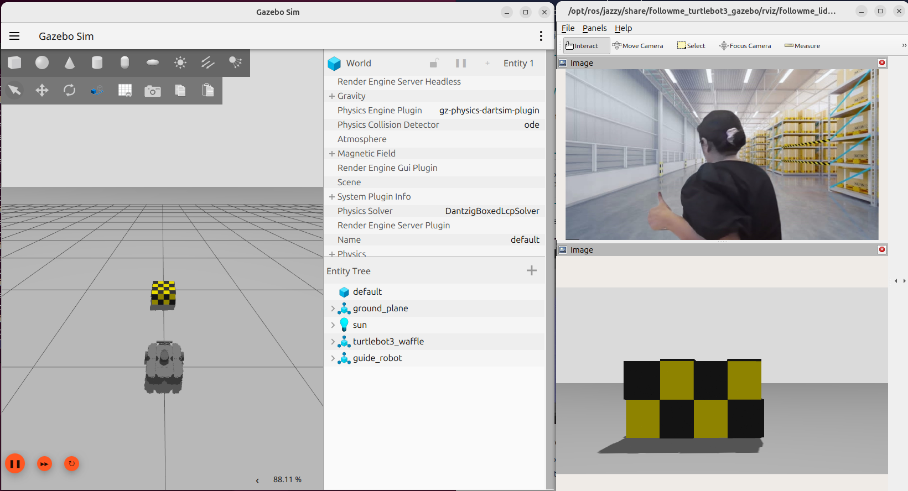

# Follow-me with ADBSCAN and Gesture Control

This demo of the Follow-me algorithm shows a Autonomous Mobile Robot application
for following a target person where the movement of the robot can be controlled
by the person's location and hand gestures. The entire pipeline diagram can be
found in the [Simulation Demos](../index.rst) page.
This demo contains only the ADBSCAN and Gesture recognition modules in the
input-processing application stack. No text-to-speech synthesis module is
present in the output-processing application stack. This demo has been tested
and validated on 12th Generation Intel® Core™ processors with Intel® Iris® Xe
Integrated Graphics (known as Alder Lake-P).
This tutorial describes how to launch the demo in `Gazebo` simulator.

## Getting Started

### Prerequisites

Complete the [get started guide](../../../../../gsg_robot/index.md)
before continuing.

### Install the Deb package

Install `ros-jazzy-followme-turtlebot3-gazebo` Deb package from Intel®
Autonomous Mobile Robot APT repository. This is the wrapper package which will
launch all of the dependencies in the backend.

<!--hide_directive::::{tab-set}
:::{tab-item}hide_directive--> **Jazzy**
<!--hide_directive:sync: jazzyhide_directive-->

```bash
sudo apt update
sudo apt install ros-jazzy-followme-turtlebot3-gazebo
```

<!--hide_directive:::
:::{tab-item}hide_directive-->  **Humble**
<!--hide_directive:sync: humblehide_directive-->

```bash
sudo apt update
sudo apt install ros-humble-followme-turtlebot3-gazebo
```

<!--hide_directive:::
::::hide_directive-->

### Activate Python Virtual Environment

```bash
sudo apt install python3-venv
python3 -m venv venv_followme
cd venv_followme
source bin/activate
```

### Install Python Modules

This application uses
[Mediapipe Hands Framework](https://mediapipe.readthedocs.io/en/latest/solutions/hands.html)
for hand gesture recognition. Install the following modules as a prerequisite
for the framework:

<!--hide_directive::::{tab-set}
:::{tab-item}hide_directive--> **Jazzy**
<!--hide_directive:sync: jazzyhide_directive-->

```bash
pip3 install --upgrade pip
pip3 install pyyaml
pip3 install -r /opt/ros/jazzy/share/followme_turtlebot3_gazebo/scripts/requirements_jazzy.txt
```

<!--hide_directive:::
:::{tab-item}hide_directive-->  **Humble**
<!--hide_directive:sync: humblehide_directive-->

```bash
pip3 install --upgrade pip
pip3 install pyyaml
pip3 install -r /opt/ros/humble/share/followme_turtlebot3_gazebo/scripts/requirements_humble.txt
```

<!--hide_directive:::
::::hide_directive-->

## Run Demo with 2D Lidar

Run the following script to launch `Gazebo` simulator and ROS 2 rviz2.

<!--hide_directive::::{tab-set}
:::{tab-item}hide_directive--> **Jazzy**
<!--hide_directive:sync: jazzyhide_directive-->

```bash
sudo chmod +x /opt/ros/jazzy/share/followme_turtlebot3_gazebo/scripts/demo_lidar.sh
/opt/ros/jazzy/share/followme_turtlebot3_gazebo/scripts/demo_lidar.sh
```

<!--hide_directive:::
:::{tab-item}hide_directive-->  **Humble**
<!--hide_directive:sync: humblehide_directive-->

```bash
sudo chmod +x /opt/ros/humble/share/followme_turtlebot3_gazebo/scripts/demo_lidar.sh
/opt/ros/humble/share/followme_turtlebot3_gazebo/scripts/demo_lidar.sh
```

<!--hide_directive:::
::::hide_directive-->

You will see two panels side-by-side: `Gazebo` GUI on the left and ROS 2 rviz
display on the right.



- The green square robot is a guide robot (namely, the target), which will
  follow a pre-defined trajectory.
- The gray circular robot is a
  [TurtleBot3](https://emanual.robotis.com/docs/en/platform/turtlebot3/simulation/#gazebo-simulation)
  robot, which will follow the guide robot. TurtleBot3 robot is equipped with a
  2D Lidar and a RealSense™ Depth Camera. In this demo, the 2D Lidar is
  used as the input topic.

**Both** of the following conditions need to be fulfilled to start the
TurtleBot3 robot:

- The target (guide robot) will be within the tracking radius of the
  TurtleBot3 robot. Radius is a reconfigurable parameter in:
  `/opt/ros/jazzy/share/adbscan_ros2_follow_me/config/adbscan_sub_2D.yaml`.

  In ROS 2 Humble, the file is located at the similar directory path.

- The gesture (visualized in the `/image` topic in ROS 2 rviz2) of the target
  is `thumbs up`.

The stop condition for the TurtleBot3 robot is fulfilled when **either one** of
the following conditions are true:

- The target (guide robot) moves to a distance of more than the tracking radius
  of the TurtleBot3 robot. Radius is a reconfigurable parameter in:
  `/opt/ros/jazzy/share/adbscan_ros2_follow_me/config/adbscan_sub_2D.yaml`).

  In ROS 2 Humble, the file is located at the similar directory path.

- The gesture (visualized in the `/image` topic in ROS 2 rviz2) of the target
  is `thumbs down`.

## Run Demo with Intel® RealSense™ Camera

Run the following script to launch `Gazebo` simulator and ROS 2 rviz2.

<!--hide_directive::::{tab-set}
:::{tab-item}hide_directive--> **Jazzy**
<!--hide_directive:sync: jazzyhide_directive-->

```bash
sudo chmod +x /opt/ros/jazzy/share/followme_turtlebot3_gazebo/scripts/demo_RS.sh
/opt/ros/jazzy/share/followme_turtlebot3_gazebo/scripts/demo_RS.sh
```

<!--hide_directive:::
:::{tab-item}hide_directive-->  **Humble**
<!--hide_directive:sync: humblehide_directive-->

```bash
sudo chmod +x /opt/ros/humble/share/followme_turtlebot3_gazebo/scripts/demo_RS.sh
/opt/ros/humble/share/followme_turtlebot3_gazebo/scripts/demo_RS.sh
```

<!--hide_directive:::
::::hide_directive-->

In this demo, RealSense™ camera of the TurtleBot3 robot is selected as
the input point cloud sensor. After running all of the above commands,
you will observe similar behavior of the TurtleBot3 robot and guide robot in the
`Gazebo` GUI as in [Run Demo with 2D Lidar](#run-demo-with-2d-lidar).

There are reconfigurable parameters in
`/opt/ros/humble/share/adbscan_ros2_follow_me/config/` directory for both LIDAR
(`adbscan_sub_2D.yaml`) and RealSense™ camera (`adbscan_sub_RS.yaml`).

The user can modify parameters depending on the respective robot, sensor
configuration and environments (if required) before running the tutorial.
Find a brief description of the parameters in the following list:

- ``Lidar_type``

  Type of the point cloud sensor. For RealSense™ camera and LIDAR inputs,
  the default value is set to ``RS`` and ``2D``, respectively.

- ``Lidar_topic``

  Name of the topic publishing point cloud data.

- ``Verbose``

  If this flag is set to ``True``, the locations of the detected target objects
  will be printed as the screen log.

- ``subsample_ratio``

  This is the downsampling rate of the original point cloud data. Default value
  = 15 (i.e. every 15-th data in the original point cloud is sampled and passed
  to the core ADBSCAN algorithm).

- ``x_filter_back``

  Point cloud data with x-coordinate > ``x_filter_back`` are filtered out
  (positive x direction lies in front of the robot).

- ``y_filter_left``, ``y_filter_right``

  Point cloud data with y-coordinate > ``y_filter_left`` and y-coordinate <
  ``y_filter_right`` are filtered out (positive y-direction is to the left of
  robot and vice versa).

- ``z_filter``

  Point cloud data with z-coordinate < ``z_filter`` will be filtered out. This
  option will be ignored in case of 2D Lidar.

- ``Z_based_ground_removal``

  Filtering in the z-direction will be applied only if this value is non-zero.
  This option will be ignored in case of 2D Lidar.

- ``base``, ``coeff_1``, ``coeff_2``, ``scale_factor``

  These are the coefficients used to calculate adaptive parameters of the
  ADBSCAN algorithm. These values are pre-computed and recommended
  to keep unchanged.

- ``init_tgt_loc``

  This value describes the initial target location. The person needs to be at a
  distance of ``init_tgt_loc`` in front of the robot to initiate the motor.

- ``max_dist``

  This is the maximum distance that the robot can follow. If the person moves at
  a distance > ``max_dist``, the robot will stop following.

- ``min_dist``

  This value describes the safe distance the robot will always maintain with the
  target person. If the person moves closer than ``min_dist``,
  the robot stops following.

- ``max_linear``

  Maximum linear velocity of the robot.

- ``max_angular``

  Maximum angular velocity of the robot.

- ``max_frame_blocked``

  The robot will keep following the target for ``max_frame_blocked`` number of
  frames in the event of a temporary occlusion.

- ``tracking_radius``

  The robot will keep following the target as long as the current target
  location = previous location +/- ``tracking_radius``

## Troubleshooting

- Failed to install Deb package: Please make sure to run `sudo apt update`
  before installing the necessary Deb packages.

- You can stop the demo anytime by pressing `ctrl-C`. If the `Gazebo` simulator
  freezes or does not stop, please use the following command in a terminal:

  ```bash
  sudo killall -9 gazebo gzserver gzclient
  ```
