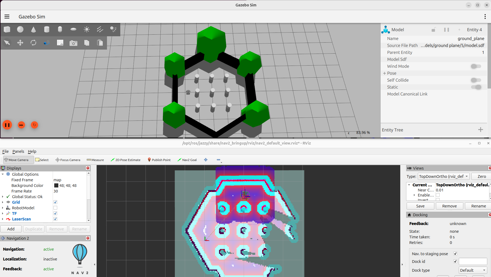

# Turtlesim ROS 2 Sample Application

This tutorial describes how to:

- Launch ROS nodes and graphic application for turtlesim.

- List ROS topics.

- Launch rqt graphic application so that the turtle can be controlled.

- Launch rviz graphic application to view ROS topics.

## Prerequisites

Complete the [get started guide](../../../gsg_robot/index.md) before continuing.

## Run the Turtlesim ROS 2 Sample application

1. To download and install the Turtlesim ROS 2 sample application run the command below:

   <!--hide_directive::::{tab-set}hide_directive-->
   <!--hide_directive:::{tab-item}hide_directive--> **Jazzy**
   <!--hide_directive:sync: jazzyhide_directive-->

   ```bash
   sudo apt-get install ros-jazzy-turtlesim-tutorial-demo
   ```

   <!--hide_directive:::hide_directive-->
   <!--hide_directive:::{tab-item}hide_directive--> **Humble**
   <!--hide_directive:sync: humblehide_directive-->

   ```bash
   sudo apt-get install ros-humble-turtlesim-tutorial-demo
   ```

   <!--hide_directive:::hide_directive-->
   <!--hide_directive::::hide_directive-->

2. Set up your ROS 2 environment

   <!--hide_directive::::{tab-set}hide_directive-->
   <!--hide_directive:::{tab-item}hide_directive--> **Jazzy**
   <!--hide_directive:sync: jazzyhide_directive-->

   ```bash
   source /opt/ros/jazzy/setup.bash
   ```

   <!--hide_directive:::hide_directive-->
   <!--hide_directive:::{tab-item}hide_directive--> **Humble**
   <!--hide_directive:sync: humblehide_directive-->

   ```bash
   source /opt/ros/humble/setup.bash
   ```

   <!--hide_directive:::hide_directive-->
   <!--hide_directive::::hide_directive-->

3. Run the Turtlesim ROS 2 sample application:

   ```bash
   ros2 launch turtlesim_tutorial turtlesim_tutorial.launch.py
   ```

4. In the rqt application, navigate to **Plugins** > **Services** > **Service Caller**.

   

   To move 'turtle1',
   choose `/turtle1/teleport_absolute` from the 'Service' dropdown list.
   Ensure to update the x and y values from their original settings.
   Press the 'Call' button to execute the teleportation.
   To close the Service Caller window, click the 'X' button.

   Expected Output: The Turtle has been relocated to the coordinates entered in the rqt application.

   

5. In the rviz application, navigate to **Add** > **By topic**. Check the option
   'Show Unvisualizable Topics' to view hidden topics.

   You will now be able to view the hidden topics from 'turtlesim'.
   To close the window, click the 'Cancel' button.

6. To close this tutorial, do the following:

   Type ``Ctrl-c`` in the terminal where you executed the command for the tutorial.
